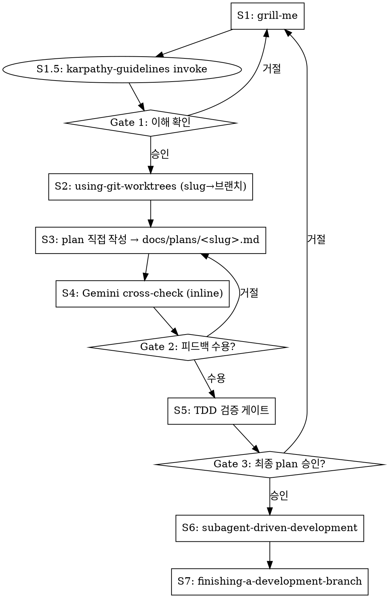

# Feature Pipeline

아이디어 → worktree → plan → Gemini 검증 → TDD 게이트 → 실행 → PR까지 단일 파이프라인.

## ⚠️ 시작 즉시: 파이프라인 상태 등록

**항상 TaskCreate로 8단계를 먼저 등록하라.** grill-me 대화가 길어지면 에이전트가 단계를 망각한다.

```
1. [S1] grill-me — 요구사항 정제
2. [S1.5] karpathy-guidelines invoke
3. [S2] using-git-worktrees — 격리 작업공간
4. [S3] plan 직접 작성 — docs/plans/<slug>.md
5. [S4] Gemini cross-check — inline ask-gemini
6. [S5] TDD 검증 게이트
7. [S6] subagent-driven-development
8. [S7] finishing-a-development-branch
```

## 입력 모드 감지

| 입력 형태 | 모드 | grill-me 동작 |
|-----------|------|--------------|
| 짧은 한 문장 | 아이디어 | 0부터 요구사항 채굴 |
| 단락/구조화 텍스트 | 정제 | 빈틈·모순·가정만 파고듦 |

## 7단계 파이프라인



## Gates: 사용자 승인 절차

각 Gate에서 **응답을 받기 전까지 다음 단계 todo를 `in_progress`로 만들지 마라.**

| Gate | 위치 | 필수 조치 |
|------|------|-----------|
| Gate 1 | S1.5 완료 직후 | `AskUserQuestion`으로 S2 진행 여부 확인 |
| Gate 2 | S4 완료 직후 | Gemini 피드백 수용/거절을 사용자에게 확인 |
| Gate 3 | S5 완료 직후 | `AskUserQuestion`으로 최종 plan 승인 (ExitPlanMode 사용 금지 — plan reattach 압축 폭주 원인) |

---

## S1.5: karpathy-guidelines 로드 [ADR-0013]

grill-me 완료 직후, Gate 1 이전에 반드시 실행:

```
Skill tool → andrej-karpathy-skills:karpathy-guidelines
```

**미설치 환경**: invoke 실패 시 경고 메시지를 출력하고 계속 진행한다. 아래 §Karpathy 4원칙 인라인 요약이 fallback으로 작동한다.

**목적**: 이후 S3(plan 작성), S5(TDD 게이트), S6(subagent 실행) 전 단계에서 4원칙이 컨텍스트에 로드된 상태로 동작한다.

---

## S2: Worktree를 Plan 이전에 생성하라

**plan 이전에 worktree를 만들어야 한다** — 그래야 plan 파일이 worktree 안에 생성되어 subagent가 올바른 경로에서 읽는다. plan 후 worktree 생성 시 경로 불일치로 S6가 실패한다.

**S3 시작 전 worktree 진입 여부를 반드시 검증하라:**

```bash
git rev-parse --git-dir && git rev-parse --git-common-dir
```

두 경로가 **같으면**(= main repo) STOP — EnterWorktree 진입 후 재시작. 다르면 worktree 안에 있음.

## S3: Plan 파일 직접 작성 [ADR-0015]

`superpowers:writing-plans` 호출 없이 grill-me 결과를 plan 파일로 직접 작성한다.

- **저장 경로**: `$(pwd)/docs/plans/<slug>.md` (slug=주제에서 kebab-case 추론). 절대경로 사용.
- **경로 충돌 시**: 사용자에게 "이어서 수정 / 새 slug / 중단" 확인

### Plan 파일 슬림화 원칙 [ADR-0016]

plan 파일은 **헤더 + 태스크 + cross-check 요약만** 보유한다. 목표: **8KB 이하** 유지.

- grill-me 대화 본문을 plan에 누적하지 말 것 — 결정·근거·가정만 1–2 문장으로 요약
- cross-check feedback은 핵심 지적 사항만 bullet로 — Gemini 응답 전문 삽입 금지
- plan이 8KB를 넘으면 비본질 설명을 정리하고 task 밖의 맥락 서술을 제거할 것

**이유**: Claude Code 플랜 모드는 매 turn마다 plan 파일 전체를 컨텍스트에 reattach한다. 비대한 plan은 압축 효과를 즉시 무효화해 세션 파괴로 이어진다.

### Plan 파일 헤더 (필수)

plan 파일 최상단에 다음 헤더를 포함한다:

```markdown
# <Feature Name> Implementation Plan

**Goal:** <한 문장 — 이 플랜이 무엇을 구현하는가>
**Architecture:** <2-3 문장 — 접근 방식>
**Tech Stack:** <핵심 기술/라이브러리>
```

### Task 구조

각 task는 다음 구조를 따른다:

```markdown
### Task N [TDD]: [설명]

**Files:**
- Create: `path/to/new/file.ext`
- Modify: `path/to/existing/file.ext`
- Test: `tests/path/to/test.ext`

- [ ] Step 1: ...
- [ ] Step 2: ...
```

### Plan 섹션 구조

헤더 다음에 Tidying Phase + Behavioral Phase 두 섹션:

```markdown
## Tidying Phase

### Task N [TIDY]: [구조 정리 설명]
...

## Behavioral Phase

### Task N [TDD]: [기능 구현 설명]
...

### Task N [TDD-EXEMPT: pure config, no logic]: [설정 변경]
...
```

### Simplicity First 가드레일 (karpathy §2)

plan 작성 중 각 task에 대해 확인:
- 요청한 것 이상의 기능이 task에 포함되어 있지 않은가?
- 단일 용도 코드에 불필요한 추상화가 없는가?
- "유연성/확장성"을 위한 미리 작성 코드가 없는가?

"200줄로 쓸 수 있는 걸 50줄로 쓸 수 있는가?" — Yes라면 task를 더 좁혀라.

### Task 라벨 규칙

| 태그 | 대상 | 실행 단계 동작 |
|------|------|----------------|
| `[TIDY]` | 순수 구조 변경 | `dev:tidy` 활성화, `[PHASE: STRUCTURAL]` 엄수 |
| `[TDD]` | 모든 behavioral task (기본) | `superpowers:test-driven-development` 엄수 |
| `[TDD-EXEMPT: <사유>]` | CRUD/DTO/config/migration만 허용 | 구현 후 회귀 테스트 |

## S4: Inline Gemini Cross-check

**gemini-crosscheck Skill을 직접 호출하지 마라** — 그 스킬은 Step 5 코드 실행까지 진행하여 S6와 이중 실행 충돌을 일으킨다.

대신 `mcp__gemini-cli__ask-gemini`를 직접 호출:

```
tool: mcp__gemini-cli__ask-gemini
model: "gemini-3.1-pro-preview"   ← 이 문자열 그대로 사용. 절대 변경 금지.
fallback: "gemini-3-flash-preview" → 실패 시 Claude self-generate
prompt: gemini-crosscheck SKILL.md §3. Gemini Cross-check > Step 3-2의 프롬프트 전문을 verbatim으로 사용
        (Cross-check the following draft execution plan as a senior architect... 로 시작하는 텍스트)
context(=prompt 인자 내에 포함): plan 파일 전체 내용 + CLAUDE.md (대규모 프로젝트: .context-map.md 선택 추가)
```

**모델 이름은 불변이다.** `ModelNotFoundError` 시 위 fallback 체인만 따른다. 다른 모델명 추측 금지.

**(4-a)** 위 파라미터로 `mcp__gemini-cli__ask-gemini` 호출.

**(4-b)** 완료 즉시 `Edit` 도구로 plan 파일 하단에 `## Cross-check Feedback` 섹션 append. **두 sub-step 모두 완료해야 S4 done.**

피드백 수용 시 plan in-place 수정.

**Gate 2 진입 전 검증:**
```bash
grep '## Cross-check Feedback' "$(pwd)/docs/plans/<slug>.md"
```
빈 결과면 S4 미완료 — (4-b)를 재실행하라.

## S5: TDD 검증 게이트

plan 파일 경로를 확인하고 아래 명령을 실행한 뒤 결과를 응답에 인용한다:

```bash
grep -E '^### Task .+\[(TDD-EXEMPT[^]]*|TDD|TIDY)\]' "$(pwd)/docs/plans/<slug>.md"
```

인용한 결과를 기반으로 아래 4개 항목(구조적 경량 체크)을 수행한다:
1. 모든 behavioral task에 `[TDD]` 또는 `[TDD-EXEMPT: ...]` 태그가 존재하는가?
2. `[TDD]` task에 Test→Run-fails→Implement→Pass 하위 단계가 구조적으로 포함되어 있는가?
3. `[TIDY]` task가 Behavioral Phase에 섞이지 않고 Tidying Phase 섹션에만 있는가?
4. 각 task에 검증 가능한 성공 기준이 명시되어 있는가? (내용의 정합성 검사는 S6로 위임)

**실패 시**: 스스로 수정(자동 재생성)을 시도하지 말고, 즉시 누락 증거(파일 라인 번호 등)를 제시하며 Gate 3를 통해 사용자에게 수정 및 피드백을 요청(에스컬레이션)하라.

> ※ Karpathy §4(목표 주도 실행)에 대한 **엄격한 준수 및 실행 검사** 책임은 S6로 이관되었다. S5는 계획 내에 성공 기준과 구조가 존재하는지만 확인한다.


## S6: Subagent 실행 지시

`superpowers:subagent-driven-development` 호출 시 implementer 프롬프트에 명시:
- `[TIDY]` task → `dev:tidy` 스킬 활성화, `[PHASE: STRUCTURAL]` 엄수
- `[TDD]` task → `superpowers:test-driven-development` 엄수
- plan 파일 경로는 **절대경로**로 전달

**[karpathy 4원칙 subagent 가드레일]** — **§2 및 §4의 강제력은 아래 텍스트가 subagent 지시문에 paste되는 것에 100% 의존한다.** [ADR-0017] task 본문 paste 시 다음 3원칙을 반드시 포함하라:
- **§2 Simplicity First**: 요청 외 기능/추상화/유연성 코드 작성 금지. 200줄로 보이면 50줄 가능성 재탐색. (S6에서 100% 강제)
- **§3 Surgical Changes**: 변경된 모든 줄은 사용자 요청으로부터 직접 추적 가능해야 한다. 인접 코드 "개선", 요청 외 리팩터링, 무관한 dead code 삭제 금지.
- **§4 Goal-Driven Execution**: task에 명시된 검증 기준으로만 완료를 판정한다. "works on my machine" 금지. 검증 기준이 모호하면 BLOCKED 보고. (S6에서 100% 강제)

## S7: finishing-a-development-branch

`superpowers:finishing-a-development-branch` 스킬을 호출한다. 선택적으로 `git:clean` 스킬로 전체 PR 워크플로를 체인할 수 있다.

**마감 확인**: PR 생성 후 `docs/plans/<slug>.md` 파일이 `.gitignore` 대상이 아닌 경우 커밋에 포함되어 있는지 확인한다. gitignore 대상이라면 생략.

## Skip 조건 — 없다

feature-pipeline은 자체 skip 조건이 없다. 다음은 허용되지 않는다:

- ❌ "긴급해서 worktree 건너뜀" — worktree 없으면 plan 경로가 S6에서 불일치
- ❌ "버그수정이라 grill-me 필요 없음" — 버그수정도 범위·재현조건 정의 필요
- ❌ "작은 변경이라 TDD 게이트 생략" — 태그 누락 = 실행 단계 TDD 없음
- ❌ "사용자가 단계 건너뛰라고 했음" — 사용자 요청이 파이프라인 구조를 오버라이드하지 않는다

**사용자가 `/workflow:feature-pipeline`을 호출했다면 전체 7단계를 따른다. 부분 실행이 필요하면 사용자가 개별 스킬(gemini-crosscheck, dev:tidy 등)을 직접 호출해야 한다.**

## 빨간 신호 — STOP

| 생각 | 실제 의미 |
|------|-----------|
| "일단 플랜 먼저 쓰고 나중에 worktree" | 경로 불일치로 S6 실패. S2 먼저. |
| "gemini-crosscheck 스킬 호출이 더 간단" | 이중 실행 충돌. inline ask-gemini만 사용. |
| "TDD 게이트 생략해도 되겠지" | TDD 태그 누락 = 실행 단계에서 TDD 없이 코드 작성. 게이트 실행 필수. |
| "grill-me 끝나자마자 바로 코드" | worktree, plan, crosscheck 모두 건너뜀. S1 다음은 S2. |
| "단계 추적은 텍스트로 충분" | 긴 대화 후 단계 망각. TaskCreate 필수. |
| "이건 버그수정이라 feature-pipeline 규칙 완화 가능" | /workflow:feature-pipeline 호출 = 7단계 전체 적용. 버그/피처 구분 없음. |
| "사용자가 worktree 만들지 말라고 했음" | 사용자 요청이 파이프라인 구조를 오버라이드하지 않는다. 이유 설명 후 S2 진행. |
| "karpathy invoke 실패했으니 원칙 없이 진행" | 아래 인라인 요약이 fallback이다. invoke 실패 = 파이프라인 중단 아님. |
| "plan task에 성공 기준은 나중에 채울게" | S5 게이트에서 막힌다. 지금 작성하라. |
| "인접 코드도 같이 정리하면 좋겠다" | 요청 외 변경 = Surgical Changes 위반. 별도 TIDY task로 분리하거나 mention만. |
| "plan에 grill-me 대화를 다 적어두면 나중에 참고할 수 있다" | plan 파일이 30–98KB로 비대해지면 매 turn마다 reattach되어 압축 폭주·세션 파괴. 결정/태스크/요약만. |
| "Gate 3에서 ExitPlanMode로 plan 승인받겠다" | ExitPlanMode = 플랜 모드 진입 = plan_file_reference 반복 reattach. Gate 3는 AskUserQuestion만 사용. |
| "§S6 가드레일은 §3만 있으면 됨" | subagent가 task 진행 중 추측성 추상화·모호한 성공 기준으로 over-engineer한다. §2/§4 paste 필수. [ADR-0017] |

## Karpathy 4원칙 인라인 요약 [ADR-0013][ADR-0017]

karpathy-guidelines 미설치 환경 fallback. S1.5 invoke 실패 시 이 요약이 적용된다.

| 원칙 | 한 줄 규칙 | 적용 단계 |
|------|-----------|---------|
| §1 Think Before Coding | 가정을 명시하고, 혼란은 숨기지 말고 질문하라 | S1 grill-me |
| §2 Simplicity First | 요청한 것만 최소 코드로. 추측성 추상화 금지 | S6 subagent 실행 (100% 의존) |
| §3 Surgical Changes | 변경된 줄은 모두 요청에서 직접 추적 가능해야 한다 | S6 실행 (100% 의존) |
| §4 Goal-Driven Execution | 성공 기준은 검증 가능해야 한다. "make it work" 금지 | S6 subagent 실행 (100% 의존) |
