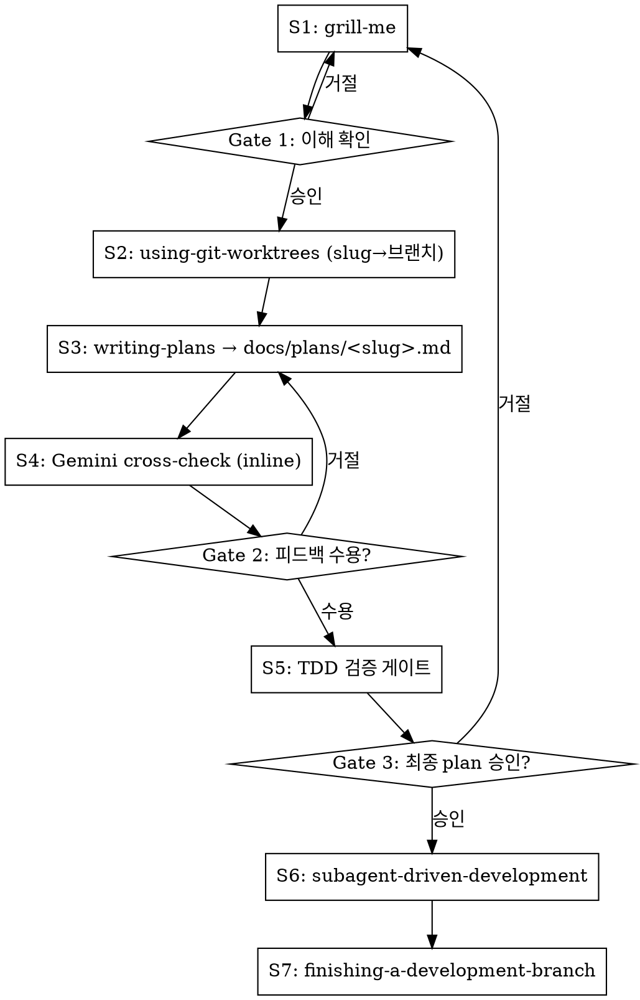

# Feature Pipeline

아이디어 → worktree → plan → Gemini 검증 → TDD 게이트 → 실행 → PR까지 단일 파이프라인.

## ⚠️ 시작 즉시: 파이프라인 상태 등록

**항상 TodoWrite로 7단계를 먼저 등록하라.** grill-me 대화가 길어지면 에이전트가 단계를 망각한다.

```
1. [S1] grill-me — 요구사항 정제
2. [S2] using-git-worktrees — 격리 작업공간
3. [S3] writing-plans — docs/plans/<slug>.md 작성
4. [S4] Gemini cross-check — inline ask-gemini
5. [S5] TDD 검증 게이트
6. [S6] subagent-driven-development
7. [S7] finishing-a-development-branch
```

## 입력 모드 감지

| 입력 형태 | 모드 | grill-me 동작 |
|-----------|------|--------------|
| 짧은 한 문장 | 아이디어 | 0부터 요구사항 채굴 |
| 단락/구조화 텍스트 | 정제 | 빈틈·모순·가정만 파고듦 |

## 7단계 파이프라인



## S2: Worktree를 Plan 이전에 생성하라

**plan 이전에 worktree를 만들어야 한다** — 그래야 plan 파일이 worktree 안에 생성되어 subagent가 올바른 경로에서 읽는다. plan 후 worktree 생성 시 경로 불일치로 S6가 실패한다.

## S3: Plan 파일 구조

`superpowers:writing-plans`를 호출하되 아래 확장 사항을 적용:
- **저장 경로**: `docs/plans/<slug>.md` (slug=주제에서 kebab-case 추론, 기본 제공 경로 오버라이드)
- **경로 충돌 시**: 사용자에게 "이어서 수정 / 새 slug / 중단" 확인
- **헤더 다음에** Tidying Phase + Behavioral Phase 두 섹션 추가

```markdown
## Tidying Phase

### Task N [TIDY]: [구조 정리 설명]
...

## Behavioral Phase

### Task N [TDD]: [기능 구현 설명]
...

### Task N [TDD-EXEMPT: pure config, no logic]: [설정 변경]
...
```

### Task 라벨 규칙

| 태그 | 대상 | 실행 단계 동작 |
|------|------|----------------|
| `[TIDY]` | 순수 구조 변경 | `dev:tidy` 활성화, `[PHASE: STRUCTURAL]` 엄수 |
| `[TDD]` | 모든 behavioral task (기본) | `superpowers:test-driven-development` 엄수 |
| `[TDD-EXEMPT: <사유>]` | CRUD/DTO/config/migration만 허용 | 구현 후 회귀 테스트 |

## S4: Inline Gemini Cross-check

**gemini-crosscheck Skill을 직접 호출하지 마라** — 그 스킬은 Step 5 코드 실행까지 진행하여 S6와 이중 실행 충돌을 일으킨다.

대신 `mcp__gemini-cli__ask-gemini`를 직접 호출:

```
tool: mcp__gemini-cli__ask-gemini
model: "gemini-3.1-pro-preview"   ← 이 문자열 그대로 사용. 절대 변경 금지.
fallback: "gemini-3-flash-preview" → 실패 시 Claude self-generate
prompt: gemini-crosscheck SKILL.md §3. Gemini Cross-check > Step 3-2의 프롬프트 전문을 verbatim으로 사용
        (Cross-check the following draft execution plan as a senior architect... 로 시작하는 텍스트)
context(=prompt 인자 내에 포함): plan 파일 전체 내용 + CLAUDE.md (대규모 프로젝트: .context-map.md 선택 추가)
```

**모델 이름은 불변이다.** `ModelNotFoundError` 시 위 fallback 체인만 따른다. 다른 모델명 추측 금지.

결과를 plan 파일 하단 `## Cross-check Feedback` 섹션에 append. 피드백 수용 시 plan in-place 수정.

## S5: TDD 검증 게이트

Plan 파일을 스캔:
1. 모든 behavioral task에 `[TDD]` 또는 `[TDD-EXEMPT: ...]` 존재하는가?
2. `[TDD]` task에 Test→Run-fails→Implement→Pass 하위 단계 존재하는가?
3. `[TIDY]` task가 Behavioral Phase에 섞이지 않고 Tidying Phase에만 있는가?

실패 시: 누락 증거(파일 라인 번호)를 제시하고 plan 1회 자동 재생성. 재차 실패 시 사용자에게 에스컬레이션.

## S6: Subagent 실행 지시

`superpowers:subagent-driven-development` 호출 시 implementer 프롬프트에 명시:
- `[TIDY]` task → `dev:tidy` 스킬 활성화, `[PHASE: STRUCTURAL]` 엄수
- `[TDD]` task → `superpowers:test-driven-development` 엄수
- plan 파일 경로는 **절대경로**로 전달

## Skip 조건 — 없다

feature-pipeline은 자체 skip 조건이 없다. 다음은 허용되지 않는다:

- ❌ "긴급해서 worktree 건너뜀" — worktree 없으면 plan 경로가 S6에서 불일치
- ❌ "버그수정이라 grill-me 필요 없음" — 버그수정도 범위·재현조건 정의 필요
- ❌ "작은 변경이라 TDD 게이트 생략" — 태그 누락 = 실행 단계 TDD 없음
- ❌ "사용자가 단계 건너뛰라고 했음" — 사용자 요청이 파이프라인 구조를 오버라이드하지 않는다

**사용자가 `/workflow:feature-pipeline`을 호출했다면 전체 7단계를 따른다. 부분 실행이 필요하면 사용자가 개별 스킬(gemini-crosscheck, dev:tidy 등)을 직접 호출해야 한다.**

## 빨간 신호 — STOP

| 생각 | 실제 의미 |
|------|-----------|
| "일단 플랜 먼저 쓰고 나중에 worktree" | 경로 불일치로 S6 실패. S2 먼저. |
| "gemini-crosscheck 스킬 호출이 더 간단" | 이중 실행 충돌. inline ask-gemini만 사용. |
| "writing-plans 없이 바로 인라인 작성" | TDD 구조 없는 plan. writing-plans 호출 필수. |
| "TDD 게이트 생략해도 되겠지" | TDD 태그 누락 = 실행 단계에서 TDD 없이 코드 작성. 게이트 실행 필수. |
| "grill-me 끝나자마자 바로 코드" | worktree, plan, crosscheck 모두 건너뜀. S1 다음은 S2. |
| "단계 추적은 텍스트로 충분" | 긴 대화 후 단계 망각. TodoWrite 필수. |
| "이건 버그수정이라 feature-pipeline 규칙 완화 가능" | /workflow:feature-pipeline 호출 = 7단계 전체 적용. 버그/피처 구분 없음. |
| "사용자가 worktree 만들지 말라고 했음" | 사용자 요청이 파이프라인 구조를 오버라이드하지 않는다. 이유 설명 후 S2 진행. |
