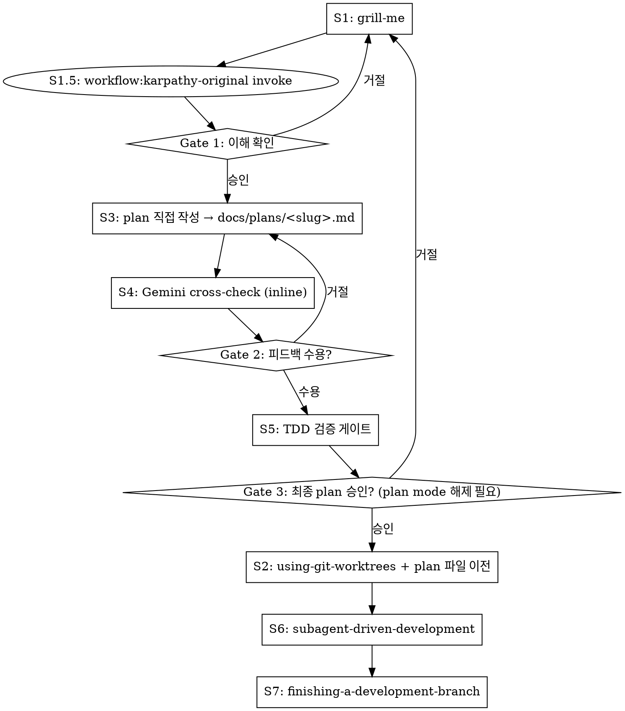

# Feature Pipeline

아이디어 → worktree → plan → Gemini 검증 → TDD 게이트 → 실행 → PR까지 단일 파이프라인.

## ⚠️ S0: 시작 즉시 — Plan Mode 감지 + 파이프라인 상태 등록

### Plan Mode 감지 (S0)

**시작 직후 1회 실행.** system-reminder에 "Plan mode is active" 문구가 있거나 `/root/.claude/plans/` 경로의 파일이 harness에 의해 부여된 경우, plan mode가 외부에서 활성화된 상태다.

**Plan mode 활성 시 안내문 출력:**

> ⚠️ **Plan mode가 외부에서 활성화된 상태입니다.**
>
> - S1(grill-me) · S1.5(karpathy) · S3(plan 작성) · S4(Gemini cross-check) · S5(TDD gate): plan mode에서 진행 가능.
> - S2(worktree 생성) · S6(subagent) · S7(commit/PR): plan mode 해제 후에만 진행.
> - Plan 파일은 harness가 부여한 경로(`/root/.claude/plans/...`)에 작성. Gate 3 승인 후 Shift+Tab으로 plan mode를 해제하면 스킬이 `docs/plans/<slug>.md`로 이전합니다.
>
> **Gate 3에서 최종 plan을 승인할 때 먼저 `Shift+Tab`으로 plan mode를 해제한 뒤 "yes"로 응답해주세요.**

### 파이프라인 상태 등록

**항상 TaskCreate로 8단계를 먼저 등록하라.** grill-me 대화가 길어지면 에이전트가 단계를 망각한다.

```
1. [S1] grill-me — 요구사항 정제
2. [S1.5] workflow:karpathy-original invoke
3. [S3] plan 직접 작성 — docs/plans/<slug>.md (plan mode 활성 시 harness 경로)
4. [S4] Gemini cross-check — inline ask-gemini
5. [S5] TDD 검증 게이트
6. [S2] using-git-worktrees — 격리 작업공간 + plan 파일 이전
7. [S6] subagent-driven-development
8. [S7] finishing-a-development-branch
```

## 입력 모드 감지

| 입력 형태 | 모드 | grill-me 동작 |
|-----------|------|--------------|
| 짧은 한 문장 | 아이디어 | 0부터 요구사항 채굴 |
| 단락/구조화 텍스트 | 정제 | 빈틈·모순·가정만 파고듦 |

## 7단계 파이프라인



## Gates: 사용자 승인 절차

각 Gate에서 **응답을 받기 전까지 다음 단계 todo를 `in_progress`로 만들지 마라.**

| Gate | 위치 | 필수 조치 |
|------|------|-----------|
| Gate 1 | S1.5 완료 직후 | `AskUserQuestion`으로 S3 진행 여부 확인 |
| Gate 2 | S4 완료 직후 | Gemini 피드백 수용/거절을 사용자에게 확인 |
| Gate 3 | S5 완료 직후 | `AskUserQuestion`으로 최종 plan 승인 (ExitPlanMode 사용 금지 — plan reattach 압축 폭주 원인). **plan mode 활성 상태라면 Shift+Tab으로 해제 후 응답 요청** [ADR-0019] |

---

## S1.5: workflow:karpathy-original 로드 [ADR-0018]

Skill tool 호출 **직전** 사용자에게 다음 안내문을 출력한다:

> **S1 (의도 추출) 완료 → S1.5 진입.** 지금 `workflow:karpathy-original` 11원칙을 컨텍스트에 로드합니다. 이후 S3(plan)·S5(TDD 게이트)·S6(subagent)에서 동일 원문이 강제됩니다.

grill-me 완료 직후, Gate 1 이전에 반드시 실행:

```
Skill tool → workflow:karpathy-original
```

**목적**: 원문 11원칙을 컨텍스트에 적재한다. 이후 S3(plan 작성)·S6(subagent 실행)에서 동일 원문이 강제된다.

---

## S3: Plan 파일 직접 작성 [ADR-0015]

> _카파시 적용: §2 Simplicity First (plan 작성 가드레일)_

`superpowers:writing-plans` 호출 없이 grill-me 결과를 plan 파일로 직접 작성한다.

- **저장 경로 (plan mode 비활성)**: `$(pwd)/docs/plans/<slug>.md` (slug=주제에서 kebab-case 추론). 절대경로 사용.
- **저장 경로 (plan mode 활성)**: harness가 부여한 경로(`/root/.claude/plans/<auto-slug>.md`)를 그대로 사용. S2 진입 직전에 `docs/plans/<slug>.md`로 이전된다. `PLAN_FILE` 변수에 실제 경로를 기록해 S4/S5 grep에 활용.
- **경로 충돌 시**: 사용자에게 "이어서 수정 / 새 slug / 중단" 확인

### Plan 파일 슬림화 원칙 [ADR-0016]

plan 파일은 **헤더 + 태스크 + cross-check 요약만** 보유한다. 목표: **16KB 이하** 유지. [ADR-0020]

- grill-me 대화 본문을 plan에 누적하지 말 것 — 결정·근거·가정만 1–2 문장으로 요약
- cross-check feedback은 핵심 지적 사항만 bullet로 — Gemini 응답 전문 삽입 금지
- plan이 16KB를 넘으면 비본질 설명을 정리하고 task 밖의 맥락 서술을 제거할 것

**이유**: Claude Code 플랜 모드는 매 turn마다 plan 파일 전체를 컨텍스트에 reattach한다. 비대한 plan은 압축 효과를 즉시 무효화해 세션 파괴로 이어진다.

### Plan 파일 헤더 (필수)

plan 파일 최상단에 다음 헤더를 포함한다:

```markdown
# <Feature Name> Implementation Plan

**Goal:** <한 문장 — 이 플랜이 무엇을 구현하는가>
**Architecture:** <2-3 문장 — 접근 방식>
**Tech Stack:** <핵심 기술/라이브러리>
**Karpathy applied:** S1.5 invoke; §2 in S3 plan, §4 in S5 gate, §1~§11 verbatim in S6 subagent
```

### Task 구조

각 task는 다음 구조를 따른다:

```markdown
### Task N [TDD]: [설명]

**Files:**
- Create: `path/to/new/file.ext`
- Modify: `path/to/existing/file.ext`
- Test: `tests/path/to/test.ext`

- [ ] Step 1: ...
- [ ] Step 2: ...
```

### Plan 섹션 구조

헤더 다음에 Tidying Phase + Behavioral Phase 두 섹션:

```markdown
## Tidying Phase

### Task N [TIDY]: [구조 정리 설명]
...

## Behavioral Phase

### Task N [TDD]: [기능 구현 설명]
...

### Task N [TDD-EXEMPT: pure config, no logic]: [설정 변경]
...
```

### Simplicity First 가드레일 (workflow:karpathy-original §2) [ADR-0018]

plan 작성 중 각 task에 대해 확인:
- No features beyond what was asked.
- No abstractions for single-use code.
- No "flexibility" or "configurability" that wasn't requested.
- No error handling for impossible scenarios.
- If you write 200 lines and it could be 50, rewrite it.

"Would a senior engineer say this is overcomplicated?" — Yes라면 task를 더 좁혀라.

### Task 라벨 규칙

| 태그 | 대상 | 실행 단계 동작 |
|------|------|----------------|
| `[TIDY]` | 순수 구조 변경 | `dev:tidy` 활성화, `[PHASE: STRUCTURAL]` 엄수 |
| `[TDD]` | 모든 behavioral task (기본) | `superpowers:test-driven-development` 엄수 |
| `[TDD-EXEMPT: <사유>]` | CRUD/DTO/config/migration만 허용 | 구현 후 회귀 테스트 |

## S4: Inline Gemini Cross-check

**gemini-crosscheck Skill을 직접 호출하지 마라** — 그 스킬은 Step 5 코드 실행까지 진행하여 S6와 이중 실행 충돌을 일으킨다.

대신 `mcp__gemini-cli__ask-gemini`를 직접 호출:

```
tool: mcp__gemini-cli__ask-gemini
model: "gemini-3.1-pro-preview"   ← 이 문자열 그대로 사용. 절대 변경 금지.
fallback: "gemini-3-flash-preview" → 실패 시 Claude self-generate
prompt: gemini-crosscheck SKILL.md §3. Gemini Cross-check > Step 3-2의 프롬프트 전문을 verbatim으로 사용
        (Cross-check the following draft execution plan as a senior architect... 로 시작하는 텍스트)
context(=prompt 인자 내에 포함): plan 파일 전체 내용 + CLAUDE.md (대규모 프로젝트: .context-map.md 선택 추가)
```

**모델 이름은 불변이다.** `ModelNotFoundError` 시 위 fallback 체인만 따른다. 다른 모델명 추측 금지.

**(4-a)** 위 파라미터로 `mcp__gemini-cli__ask-gemini` 호출.

**(4-b)** 완료 즉시 `Edit` 도구로 plan 파일 하단에 `## Cross-check Feedback` 섹션 append. **두 sub-step 모두 완료해야 S4 done.**

피드백 수용 시 plan in-place 수정.

**Gate 2 진입 전 검증:**
```bash
# $PLAN_FILE = plan mode 비활성 시 "$(pwd)/docs/plans/<slug>.md"
#             plan mode 활성 시 harness 부여 경로 "/root/.claude/plans/<auto>.md"
grep '## Cross-check Feedback' "$PLAN_FILE"
```
빈 결과면 S4 미완료 — (4-b)를 재실행하라.

## S5: TDD 검증 게이트

> _카파시 적용: §4 Goal-Driven Execution (구조 검사만; 엄격한 §4 검사는 S6)_

plan 파일 경로(`$PLAN_FILE`)를 확인하고 아래 명령을 실행한 뒤 결과를 응답에 인용한다:

```bash
# $PLAN_FILE = S3에서 결정된 실제 plan 파일 경로 (절대경로)
grep -E '^### Task .+\[(TDD-EXEMPT[^]]*|TDD|TIDY)\]' "$PLAN_FILE"
```

인용한 결과를 기반으로 아래 4개 항목(구조적 경량 체크)을 수행한다:
1. 모든 behavioral task에 `[TDD]` 또는 `[TDD-EXEMPT: ...]` 태그가 존재하는가?
2. `[TDD]` task에 Test→Run-fails→Implement→Pass 하위 단계가 구조적으로 포함되어 있는가?
3. `[TIDY]` task가 Behavioral Phase에 섞이지 않고 Tidying Phase 섹션에만 있는가?
4. 각 task에 검증 가능한 성공 기준이 명시되어 있는가? (내용의 정합성 검사는 S6로 위임)

**실패 시**: **즉시 STOP.** 스스로 수정(자동 재생성) 금지. 누락 증거(파일 라인 번호)를 사용자에게 제시하고 plan 파일 수정을 요청. Gate 3 진입은 S5 grep 4종이 모두 통과한 뒤에만 허용된다. [ADR-0020]

> ※ 원문 §4 Goal-Driven Execution (workflow:karpathy-original)에 대한 **엄격한 준수 및 실행 검사** 책임은 S6로 이관되었다. S5는 계획 내에 성공 기준과 구조가 존재하는지만 확인한다. [ADR-0018]


## S2: Gate 3 통과 후 Worktree 생성 + Plan 파일 이전 [ADR-0019]

Gate 3 승인 직후, S6 진입 전에 실행한다.

### Plan mode 해제 재확인

plan mode 활성 상태에서 Gate 3 yes를 받은 경우, S2 진입 전 해제 여부를 재확인한다. 여전히 활성이면:

> "plan mode가 아직 활성 상태입니다. Shift+Tab으로 해제한 뒤 다시 "yes"로 응답해주세요."

최대 2회 재시도 후에도 해제되지 않으면 STOP — 사용자에게 수동 진행 안내.

### Worktree 생성

```
Skill tool → superpowers:using-git-worktrees
```

### Plan 파일 이전 (plan mode 출처인 경우만)

plan mode 활성 상태에서 시작해 `$PLAN_FILE`이 `/root/.claude/plans/` 경로라면, worktree 생성 직후 아래 절차로 `docs/plans/<slug>.md`로 이전한다.

```bash
# slug는 grill-me 결과 기반 kebab-case (plan 헤더 Goal 라인에서 추론)
DEST="$(pwd)/docs/plans/<slug>.md"

# 충돌 가드
if [ -e "$DEST" ]; then
    # 사용자에게 "이어서 수정 / 새 slug / 중단" 확인
fi

# git mv 시도 (이미 staged/tracked 파일인 경우)
git mv "$PLAN_FILE" "$DEST" 2>/dev/null || {
    # fallback: untracked 파일인 경우
    mv "$PLAN_FILE" "$DEST" && git add "$DEST"
}

export PLAN_FILE="$DEST"
```

### Worktree 내 cwd 검증

```bash
pwd && git rev-parse --show-toplevel
```

두 경로가 **같으면**(= main repo) STOP — EnterWorktree 진입 후 재시작. 다르면 worktree 안에 있음. [ADR-0014][ADR-0019]

---

## S6: Subagent 실행 지시

> _카파시 적용: §1~§11 원문 verbatim paste (강제력 100%)_

### Plan 파일 존재 검증 (S6 pre-flight) [ADR-0020]

```bash
test -f "$PLAN_FILE" && [ -s "$PLAN_FILE" ] || { echo "STOP: plan 파일이 없거나 비어 있다 — S3 미완료"; exit 1; }
```

검증 실패 시 subagent 디스패치 금지. S3로 돌아가 plan 파일을 먼저 작성할 것.

`superpowers:subagent-driven-development` 호출 시 implementer 프롬프트에 명시:
- `[TIDY]` task → `dev:tidy` 스킬 활성화, `[PHASE: STRUCTURAL]` 엄수
- `[TDD]` task → `superpowers:test-driven-development` 엄수
- plan 파일 경로는 **절대경로**로 전달

**[karpathy 원문 11원칙 subagent 가드레일]** — **아래 11원칙은 `workflow:karpathy-original` 원문 verbatim. paraphrase 금지. subagent task 본문에 그대로 paste하라. §1~§11 강제력은 이 paste에 100% 의존한다.** [ADR-0018]

---

Behavioral guidelines to reduce common LLM coding mistakes. Merge with project-specific instructions as needed.

**Tradeoff:** These guidelines bias toward caution over speed. For trivial tasks, use judgment.

## 1. Think Before Coding

**Don't assume. Don't hide confusion. Surface tradeoffs.**

Before implementing:
- State your assumptions explicitly. If uncertain, ask.
- If multiple interpretations exist, present them - don't pick silently.
- If a simpler approach exists, say so. Push back when warranted.
- If something is unclear, stop. Name what's confusing. Ask.

## 2. Simplicity First

**Minimum code that solves the problem. Nothing speculative.**

- No features beyond what was asked.
- No abstractions for single-use code.
- No "flexibility" or "configurability" that wasn't requested.
- No error handling for impossible scenarios.
- If you write 200 lines and it could be 50, rewrite it.

Ask yourself: "Would a senior engineer say this is overcomplicated?" If yes, simplify.

## 3. Surgical Changes

**Touch only what you must. Clean up only your own mess.**

When editing existing code:
- Don't "improve" adjacent code, comments, or formatting.
- Don't refactor things that aren't broken.
- Match existing style, even if you'd do it differently.
- If you notice unrelated dead code, mention it - don't delete it.

When your changes create orphans:
- Remove imports/variables/functions that YOUR changes made unused.
- Don't remove pre-existing dead code unless asked.

The test: Every changed line should trace directly to the user's request.

## 4. Goal-Driven Execution

**Define success criteria. Loop until verified.**

Transform tasks into verifiable goals:
- "Add validation" → "Write tests for invalid inputs, then make them pass"
- "Fix the bug" → "Write a test that reproduces it, then make it pass"
- "Refactor X" → "Ensure tests pass before and after"

For multi-step tasks, state a brief plan:
```text
1. [Step] → verify: [check]
2. [Step] → verify: [check]
3. [Step] → verify: [check]
```

Strong success criteria let you loop independently. Weak criteria ("make it work") require constant clarification.

## 5. No Closing Colons (Korean Output)

**End Korean sentences with a period, not a colon.**

When the user writes in Korean, your output is also Korean:
- Don't end sentences with `:` even if the next line is a list or example.
- LLMs trained on English docs leak the colon habit into Korean. Catch it.
- The test: every Korean sentence terminator should be `.`, `?`, or `!` — not `:`.
- Colons are fine inside code, key-value pairs, or labels. Not as sentence enders.

## 6. File Header Comments in Korean

**First line of every new source file: a one-line Korean comment stating its role.**

When creating a new file:
- TypeScript/JavaScript: `// 사용자 인증 상태를 관리하는 Context Provider`
- Python: `# KIS API 호출을 비동기로 래핑하는 클라이언트`
- SQL: `-- 일별 집계 결과를 저장하는 머티리얼라이즈드 뷰`
- Place it directly under required directives (`'use client'`, `'use server'`, shebang).
- Skip config files (`*.config.ts`, `package.json`, etc.).

Why: agents read files selectively, not whole codebases. A one-line Korean header gives instant context so the next session (human or agent) can navigate without re-reading the entire file.

## 7. Plan + Checklist + Context Storage

**Before any non-trivial task, plan and store context in designated directories.**

- **Plan** — what we're building and why.
- **Checklist** (`checklist.md`) — concrete tasks as checkboxes. Tick as you go.
- **Context Storage** — Record important decisions permanently in the following paths:
  - **`.claude/CLAUDE.md`**: Global agent instructions and coding conventions.
  - **`.claude/rules/*.md`**: Domain, module, or workflow-specific rules (e.g., API integration rules, state management patterns).
  - **`docs/decisions/*.md` (ADR)**: Important architecture, framework choices, and system design decisions along with their background.

If the user gives only a plan and asks you to start coding, stop and ask: "Should I create the checklist and update context records first?" The next session needs these records to pick up where you left off.

## 8. Run Tests Before Marking Complete

**If you touched code, run the tests before saying "done".**

- `npm test`, `pytest`, `cargo test`, whatever the project uses — run it.
- If tests pass, report results. If they fail, fix and re-run.
- No test setup? At minimum, verify the project builds/compiles.
- Run tests proactively, before the user signals "끝", "완료", "다 됐어" — not after.

This is the step LLMs skip most often. Treat it as non-negotiable.

## 9. Semantic Commits

**Commit when one logical change is complete. Don't wait for the user to ask.**

- The test: "Can I describe this commit in one sentence?" If yes, commit. If no, the changes are still mixed — split them.
- Good: "auth 미들웨어 추가". Bad: "auth 추가하고 UI도 고치고 버그도 수정" (split into 3).
- Don't accumulate 20 unrelated edits and lose the ability to roll back individually.
- Don't commit just to commit — meaningful units only.

Note: For solo prototypes or throwaway scripts, group commits loosely if it slows you down. The point is reversibility, not ceremony.

## 10. Read Errors, Don't Guess

**Read the actual error/log line. Don't pattern-match from memory.**

When something fails:
- Read the full error message and stack trace.
- Check the actual log output, not what you assume it should say.
- Don't apply a "common fix" before confirming the cause.
- If unclear, add a print/log to verify state — then fix.

This is the step LLMs skip most often after "run tests". They guess from error keywords and apply the most-recent-pattern fix. That's how a one-line bug becomes a three-file refactor.

## 11. Prevent Infinite Loops (Rule of 3)

**If the same error or failure repeats 3 times, stop and ask.**

When attempting to fix a bug or implement a feature:
- If you modify the code, test/run it, and encounter the **exact same error** 3 times in a row, your current approach or assumption is fundamentally flawed.
- Do not blindly continue modifying code and wasting tokens/resources.
- Stop immediately and summarize the situation for the user:
  1. The exact issue/error occurring.
  2. The 3+ approaches you have tried so far.
  3. Your hypothesis on why it's failing.
- Wait for the user's feedback or new direction before proceeding.

---

## S7: finishing-a-development-branch

`superpowers:finishing-a-development-branch` 스킬을 호출한다. 선택적으로 `git:clean` 스킬로 전체 PR 워크플로를 체인할 수 있다.

**마감 확인**: PR 생성 후 `docs/plans/<slug>.md` 파일이 `.gitignore` 대상이 아닌 경우 커밋에 포함되어 있는지 확인한다. gitignore 대상이라면 생략.

## Skip 조건 — 없다

feature-pipeline은 자체 skip 조건이 없다. 다음은 허용되지 않는다:

- ❌ "긴급해서 worktree 건너뜀" — S2(worktree 생성)를 건너뛰면 S6 subagent가 올바른 격리 경로에서 실행되지 않아 의도치 않은 main repo 변경 발생
- ❌ "버그수정이라 grill-me 필요 없음" — 버그수정도 범위·재현조건 정의 필요
- ❌ "작은 변경이라 TDD 게이트 생략" — 태그 누락 = 실행 단계 TDD 없음
- ❌ "사용자가 단계 건너뛰라고 했음" — 사용자 요청이 파이프라인 구조를 오버라이드하지 않는다

**사용자가 `/workflow:feature-pipeline`을 호출했다면 전체 7단계를 따른다. 부분 실행이 필요하면 사용자가 개별 스킬(gemini-crosscheck, dev:tidy 등)을 직접 호출해야 한다.**

## 빨간 신호 — STOP

| 생각 | 실제 의미 |
|------|-----------|
| "일단 플랜 먼저 쓰고 나중에 worktree" | **의도된 순서다.** S3(plan) → S4 → S5 → S2(worktree+이전) → S6가 정상 흐름. plan mode 외부 활성 호환 + reattach 회피를 위해 설계. [ADR-0019] |
| "gemini-crosscheck 스킬 호출이 더 간단" | 이중 실행 충돌. inline ask-gemini만 사용. |
| "TDD 게이트 생략해도 되겠지" | TDD 태그 누락 = 실행 단계에서 TDD 없이 코드 작성. 게이트 실행 필수. |
| "grill-me 끝나자마자 바로 코드" | worktree, plan, crosscheck 모두 건너뜀. S1 다음은 S1.5 → S3 → S4 → S5 → S2. (ADR-0019 시퀀스) |
| "plan 파일 없이 바로 S6/subagent" | plan_file_reference 없는 subagent = goal-driven 위반 + 검증 불가. S6 pre-flight(`test -f`)가 STOP. [ADR-0020] |
| "단계 추적은 텍스트로 충분" | 긴 대화 후 단계 망각. TaskCreate 필수. |
| "이건 버그수정이라 feature-pipeline 규칙 완화 가능" | /workflow:feature-pipeline 호출 = 7단계 전체 적용. 버그/피처 구분 없음. |
| "사용자가 worktree 만들지 말라고 했음" | 사용자 요청이 파이프라인 구조를 오버라이드하지 않는다. 이유 설명 후 S2 진행. |
| "karpathy 원칙 없이 S6 진행해도 되겠지" | 로컬 스킬이라 invoke 실패가 없다. S6 paste에 §1~§11 원문이 포함되지 않으면 강제력이 없다. [ADR-0018] |
| "plan task에 성공 기준은 나중에 채울게" | S5 게이트에서 막힌다. 지금 작성하라. |
| "인접 코드도 같이 정리하면 좋겠다" | 요청 외 변경 = Surgical Changes 위반. 별도 TIDY task로 분리하거나 mention만. |
| "plan에 grill-me 대화를 다 적어두면 나중에 참고할 수 있다" | 16KB 초과 시 즉시 슬림화. plan 파일이 30–98KB로 비대해지면 매 turn마다 reattach되어 압축 폭주·세션 파괴. 결정/태스크/요약만. [ADR-0020] |
| "Gate 3에서 ExitPlanMode로 plan 승인받겠다" | ExitPlanMode = 플랜 모드 진입 = plan_file_reference 반복 reattach. Gate 3는 AskUserQuestion만 사용. 외부에서 plan mode가 이미 활성인 경우는 사용자에게 Shift+Tab 해제를 요청한다. [ADR-0016][ADR-0019] |
| "§S6 가드레일은 §2/§3/§4만 있으면 됨" | subagent는 §1 가정 표면화·§5~§11도 놓친다. §1~§11 원문 verbatim paste 필수. [ADR-0018] |

