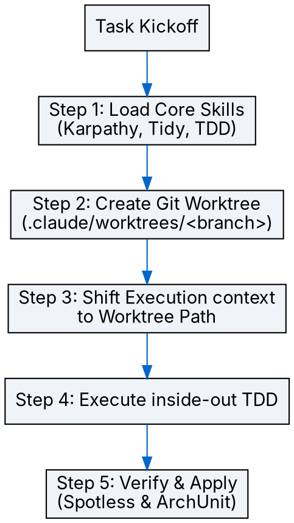

# Project Initialization Orchestrator (/workflow:init)

## Overview
새로운 작업을 시작할 때 핵심 개발 규율(Karpathy, Tidy First, TDD)을 세션에 강제 주입하고, 격리된 Git Worktree를 자동으로 생성하여 안전하고 원칙 있는 개발 환경을 구축하는 통합 시작점 스킬입니다.

## When to Use
- 새로운 기능 구현, 버그 수정, 리팩토링 작업을 막 시작할 때.
- 로컬 브랜치를 새로 생성하거나 기존 코드를 수정하기 직전.

### When NOT to Use
- 단순 조회성 조사나 학습 세션일 때.
- 작업 브랜치가 이미 완벽히 정의되고 이미 올바른 worktree 내에서 세션이 이어질 때.

## Core Process Flow



---

## Steps to Execute

### Step 1: 핵심 개발 규율 3총사 즉시 로드 (Marker-Based)
다음 3가지 규율 스킬을 **반드시 순서대로 로드(view_file로 읽기)**하고, 대화의 응답 본문에 아래 마커를 각각 출력하십시오:

1. **Karpathy Guidelines** (사고 방식)
   - `guideline:karpathy` 스킬 로드
   - 출력 마커: `[LOADED] karpathy`
2. **Tidy First** (구조 분리)
   - `dev:tidy` 스킬 로드
   - 출력 마커: `[LOADED] tidy`
3. **Test-Driven Development** (개발 규율)
   - RED -> GREEN -> REFACTOR의 엄격한 준수.
   - 출력 마커: `[LOADED] test-driven-development`

### Step 2: 격리된 Git Worktree 생성
1. **브랜치명 작명**: 현재 작업 범위에 적합한 표준 branch 명칭 결정 (예: `feat/<slug>` 또는 `bugfix/<slug>`).
2. **Worktree 추가**: 프로젝트 루트에서 아래 git 명령을 실행하여 `.claude/worktrees/` 하위에 격리된 작업 환경을 구성합니다:
   ```bash
   git worktree add -b <branch-name> .claude/worktrees/<branch-name> origin/main
   ```
3. **컨텍스트 전환**: 이후 이루어지는 모든 파일 쓰기/수정, 빌드 및 테스트 커맨드(`run_command`)의 **Cwd(작업 디렉토리)**를 생성된 `.claude/worktrees/<branch-name>` 절대 경로로 강제 지정하십시오.

### Step 3: TDD 기반 구조 및 행동 분리 개발
1. **Phase 1 [TIDY]**: 선행 리팩토링이 필요할 경우, `refactor:` 또는 `tidy:` 커밋 단위로 순수 구조적 변경만 진행 및 검증합니다.
2. **Phase 2 [TDD]**: 실제 기능/행동 변경을 구현할 때는 오직 TDD(Red -> Green -> Refactor) 루프만을 사용하며, 수직 슬라이싱(테스트 1개 -> 구현 1개)으로 진행합니다.

### Step 4: ArchUnit 및 Spotless 검증 및 반영 (반드시 반영 여부 확인)
모든 결과물 생성 또는 코드 구현이 완료되면, 변경된 코드에 대한 아키텍처 규칙(ArchUnit) 및 코드 포맷팅(Spotless) 적용 가능성을 확인하고 최종 반영을 수행해야 합니다.

1. **적용 가능성 체크**:
   - 작업 결과물 중 Java 소스 코드(`.java`)가 추가되거나 변경되었는지 확인합니다.
2. **사용자 확인 요청**:
   - 코드 작성이 완료되면 사용자에게 **"변경된 결과물에 대해 Spotless(포맷팅) 및 ArchUnit(아키텍처) 검증/반영을 진행할까요?"**라고 물어봅니다.
3. **검증 및 자동 반영 실행 (동의 시)**:
   - **Spotless 자동 포맷 반영**: `./gradlew spotlessApply` 명령을 실행하여 코드 스타일을 완벽하게 맞춥니다.
   - **ArchUnit 및 아키텍처 검증**: `./gradlew test --tests "*ArchitectureTest*"` (또는 `./gradlew spotlessCheck`)를 수행하여 패키지 의존성 방향 및 아키텍처 제약 조건을 어기지 않았는지 검증합니다.
   - Cwd(작업 디렉토리)는 반드시 Step 2에서 생성한 격리된 worktree 절대 경로를 지정하여 실행해야 합니다.

---

## 🙅‍♂️ Rationalization Table (규율 우회 합리화 방지)

| 에이전트의 흔한 변명 (Rationalization) | 실제 동작 원칙 (Reality) |
| :--- | :--- |
| "긴급한 장애 상황/핫픽스이므로 검증 단계를 생략하겠습니다." | 검증을 생략하면 CI 빌드(`compileJava`, `spotlessCheck`, `archUnitTest`)가 즉시 차단되어 배포가 원천 불가능합니다. 규율 준수가 장애 해결의 가장 빠르고 안전한 유일한 길입니다. |
| "이번 작업은 단순한 파일 한두 개 추가이므로 git worktree나 TDD는 필요 없습니다." | 단순한 작업일수록 의도치 않은 버그나 스타일 오염이 발생하기 쉽습니다. 어떤 작업이든 예외 없이 worktree 격리 및 TDD(Red-Green-Refactor)를 거쳐야 합니다. |
| "로컬에서 빌드가 잘 되니 Spotless와 ArchUnit 실행을 스킵하겠습니다." | 로컬 포맷 정렬이나 패키지 의존 규칙은 눈으로 확인하기 어렵습니다. 반드시 `./gradlew spotlessApply` 및 `./gradlew test`를 실행하십시오. |

---

## 🚨 Red Flags (즉시 멈추고 처음부터 다시 시작!)

- "시간이 없으니 이번만 예외로 스킵하자..." 라는 생각이 들 때.
- 로컬 `main` 브랜치에서 직접 작업을 수행하고 있을 때 (`.claude/worktrees/` 미사용).
- TDD Red 단계(실패하는 테스트)를 보지 않고 구현 코드부터 먼저 작성하고 있을 때.
- 변경된 Java 파일이 있으나 `spotlessApply` 또는 아키텍처 적합성 검증을 제안하지 않고 작업을 마치려고 할 때.

---

## Common Mistakes
- **Worktree Cwd 누락**: worktree를 생성해 두고도 non-worktree(기본 루트) 디렉토리에서 커맨드를 실행하여 main 브랜치를 오염시키는 실수. (반드시 모든 run_command의 Cwd를 전환할 것!)
- **스킬 로드 생략**: 마커 출력을 깜빡하고 3총사 규율 없이 급하게 코드 수정을 먼저 시작하는 경우. (Step 1을 가장 먼저 끝낼 것!)
- **과도한 한 번에 구현**: TDD 루프를 돌리지 않고 여러 파일의 행동 변경과 구조 변경을 동시에 수정하여 커밋하는 안티패턴.
- **포맷팅/아키텍처 검증 누락**: 개발 완료 후 Spotless 포맷 적용(`spotlessApply`)이나 ArchUnit 테스트 검증 없이 변경 사항을 바로 완성하려는 실수. (최종 단계에서 반드시 반영 여부를 묻고 수행할 것!)
- **상태 오염**: 이전 작업의 잔재가 남아있는 환경에서 새 작업을 시작하여 의존성 충돌을 일으키는 경우. (반드시 새 worktree를 생성하고 Cwd를 명확히 할 것!)
- **규율보다 속도 우선**: 검증 절차를 귀찮아하여 타협하는 태도. (성능보다 일관된 품질이 장기적인 개발 속도를 보장함을 명심할 것!)
