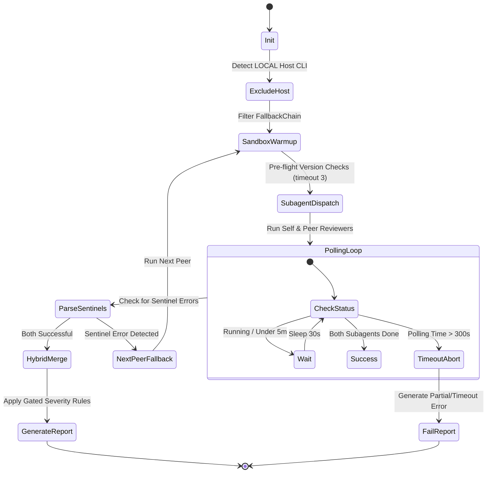

# Data Model: Peer Orchestrator Integration

This document defines the key data structures, state transitions, and validation rules for the multi-LLM Peer Orchestration process.

---

## 1. Key Entities

### 1.1. Finding

Represents a single issue flagged during code review.

* **Attributes**:
  * `file`: String (relative file path in repository)
  * `line`: Integer (1-indexed line number where finding occurs)
  * `severity`: Enum (`Critical`, `High`, `Medium`, `Low`)
  * `message`: String (descriptive markdown comment explaining the issue and recommending a fix)

* **Validation Rules**:
  * `file` must point to a file that exists or is modified in git diff.
  * `line` must be greater than or equal to 1.
  * `severity` must match one of the predefined Enum values.
  * `message` must not be empty.

---

### 1.2. FallbackChain

Manages the list of peer LLM CLIs that are sequentially executed if previous tools fail.

* **Attributes**:
  * `peers`: Array of Strings (default: `["claude", "agy", "openai"]`)
  * `active_peer`: String (the peer currently being evaluated)
  * `excluded_peer`: String (the host CLI LLM that has been excluded)

---

### 1.3. Sentinel

A signal representing process failures during CLI tool executions.

* **Predefined Values**:
  * `CLI_NOT_FOUND`: The peer command binary is not installed on the system path.
  * `CLI_TIMEOUT`: Execution took longer than the allotted 3-second version check or subagent-specific CLI threshold.
  * `CLI_ERROR`: The process returned a non-zero exit code during execution.

---

## 2. State Transitions

The orchestrator transitions through the following states:

